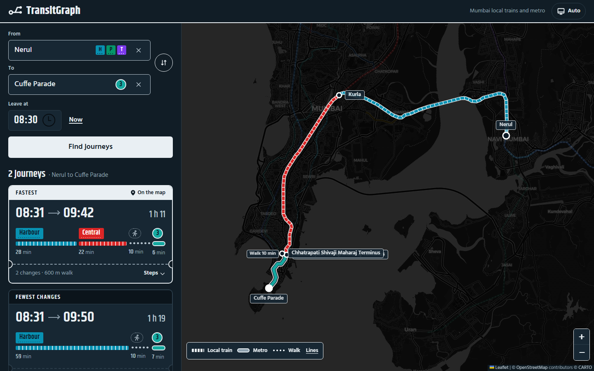
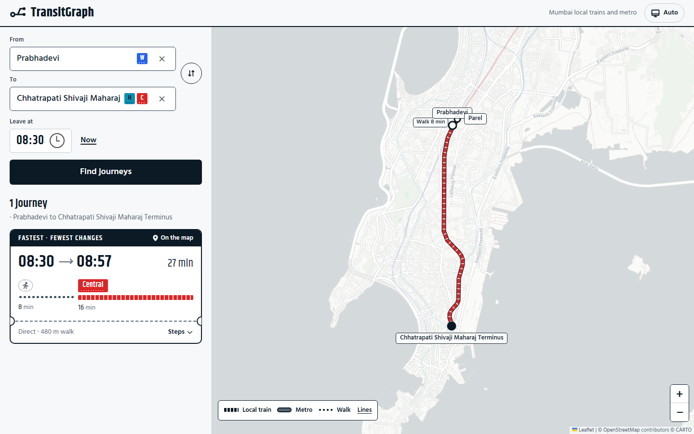

# TransitGraph

A journey planner for Mumbai that routes across local trains and the metro in a single search, including the walk between a local station and a metro station.

Live demo: https://transit-graph.vercel.app



## Features

- One search across the Western, Central, Harbour, Trans-Harbour and Port local lines and Metro Lines 1, 2A, 2B, 3 and 7+9.
- Walking is part of the route. A journey can begin, end or change with a walk, such as Prabhadevi (Western) to Parel (Central) or Andheri station to Andheri on Metro Line 1. A short trip can be a walk and nothing else.
- Results are the fastest journey and the one with the fewest changes, when those differ. Each can be expanded into a stop by stop view.
- The selected journey is drawn on the map. Local trains, metro and walking have separate shapes (ticked rectangle, round badge, dots), and each line keeps its own colour.
- Station search matches any word in the name, so "road" finds Matunga Road.
- Light and dark themes, usable on a phone.



## How it works

```
React app  <->  Node API  <->  C++ routing engine
                                      |
                              GTFS files in data/gtfs
```

**Routing engine.** The engine implements RAPTOR (Round-Based Public Transit Routing, Delling, Pajor and Werneck). It works in rounds, and round *k* finds the earliest arrival using *k* vehicles. Collecting the best result of each round gives a Pareto front of arrival time against number of vehicles, which is where "fastest" and "fewest changes" come from. Timetable data is held in flat arrays, trips on a route are binary searched by departure time, and a route is split wherever one train overtakes another so the search stays correct. Walking links are stored as a compressed sparse row graph. A change between vehicles takes a fixed 5 minutes, and a walk costs its walking time and does not count as a vehicle. The engine covers a 48 hour window, so late night trips that cross midnight work.

**API.** An Express server keeps one engine process running and exchanges one line per request with it over stdin and stdout, matched by request id. It restarts the engine if it exits, fails requests the engine does not answer within 5 seconds, and validates input before it reaches the engine. Station search is backed by a prefix trie, and route results are cached in an LRU cache. Map shapes are served gzipped.

**Web app.** React with Vite and Leaflet. Line shapes are loaded once as GeoJSON, and route responses only carry line ids and times. Fonts are self-hosted.

## Data

| Source | Contents |
|---|---|
| Western, Central, Harbour, Trans-Harbour and Port line passenger timetables (PTT) | 123 stations, 2,998 weekday trips |
| Metro operators' published first and last trains and headways | Lines 1, 2A, 2B (phase 1), 3 and 7+9: 78 stations, 1,519 trips |
| OpenStreetMap | Metro stations and tracks, and walking routes between stations |

Local train times come from the printed timetables. Metro operators publish how often trains run, not timetables, so metro trips are generated from those headways. Walking links are the pairs of stations of different lines that are within 1 km of each other, with the distance taken from a pedestrian route on OpenStreetMap. 27 pairs qualify.

## Getting started

Requirements: a C++17 compiler, Node.js 18 or newer, and Python 3 only if the data is rebuilt.

```bash
# engine
cd engine
g++ -O3 -std=c++17 src/main.cpp src/raptor.cpp src/gtfs_parser.cpp -o raptor

# API, on http://localhost:3000
cd ../api
npm install
node server.js

# web app, on http://localhost:5173
cd ../web
npm install
npm run dev
```

The dev server proxies `/api` to the API. Two optional environment variables are read by the web app:

- `VITE_API_URL`: base URL of the API. Empty by default.
- `VITE_CARTO_API_KEY`: a [CARTO](https://carto.com) key for the grey basemap. Without it the map uses OpenStreetMap tiles.

To rebuild the data, install `scripts/requirements.txt` and run `ingest_ptt.py`, `compile_gtfs.py`, `generate_shapes_kml.py`, `build_transfers.py` and `validate_gtfs.py` from `scripts/`, in that order.

## Project structure

```
engine/    C++ RAPTOR engine, GTFS parser, LRU cache
api/       Express API, prefix trie, LRU cache
web/       React app
data/      GTFS output, station names, metro definitions, source timetables
scripts/   data pipeline
tests/     engine and API tests
```

## Built with

C++17, Node.js and Express, React, Vite, Leaflet, Python (pandas, NetworkX), OpenStreetMap, Valhalla, CARTO basemaps.
